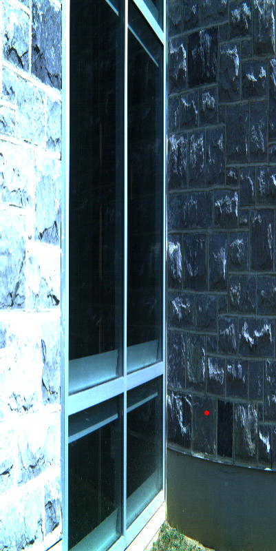
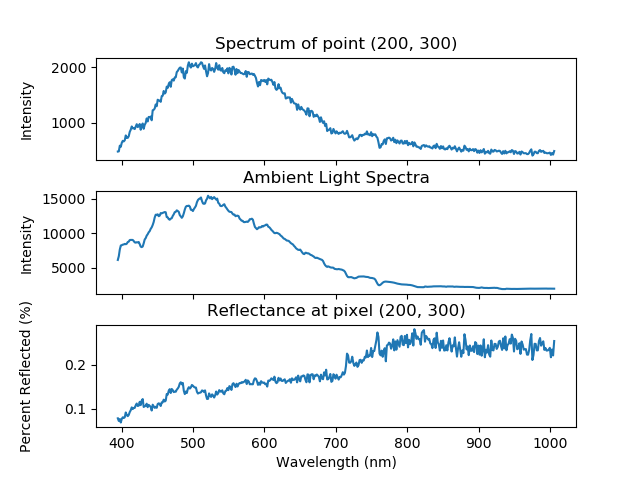

# HSImage #

Interface Library for ENVI-BIL Hyperspectral Images
(C++/Python)

This library is designed to allow open-source experimentation with ENVI-BIL hyperspectral images. The goal of this software is to promote the study of hyperspectral images in the academic computer vision research world. This software provides both a C++ and Python interface for ease of use. An associated project has resulted in a publicly available library of images available at [https://osf.io/pd49t/](https://osf.io/pd49t/). These images are all compatible and intended to be used with this software interface library.

## Installation ##
NOTE: This software, while it is build with only cross-platform libraries, has not been tested on Windows. It currently has been tested on MacOS 10.11.x and Ubuntu 14.04. If a user wishes to use this software on Windows, it should be possible to build and run, but there may be issues in the linking of the OpenCV libraries. Environment variable settings on Windows can be tricky, and there is no official Windows support for HSImage at this time.

This package requires: 
1) Python >= 2.7 or Python >= 3.2
2) Boost
3) Numpy
4) OpenCV 3.x - C++ and Python
	(OpenCV 2.x is NOT supported)


The practice of using Python virtual environments is recommended. To set up a virtual environment, type the following into terminal:
```bash
pip install virtualenv
virtualenv hsi_env
source hsi_env/bin/activate
```

Virtualenvwrapper is a convenience package built around virtualenv and is optional for this software, but is useful for managing multiple virtual environments. THIS DOES NOT NEED TO BE INSTALLED FOR HSI TO FUNCTION.

 To install it and use it to create a virtual environment, type the following into terminal:
```bash
pip install virtualenv virtualenvwrapper
source /usr/local/bin/virtualenvwrapper.sh
mkvirtualenv hsi_env
workon hsi_env
```

After these steps you will be in a Python virtual environment named `hsi_env`

To install Boost and Numpy type into the terminal
```bash
sudo apt-get install libboost-dev
pip install numpy
```

The OpenCV 3.x installation is non-trivial, as the HSI package requires both the Python and C++ OpenCV libraries. If you already have OpenCV 3.x with the appropriate Python version installed, there should be no additional steps needed to install HSImage.
If you do not have OpenCV installed, a bash script on the repository will can peform the installation for you on Ubuntu. The steps in the script should be appropriate for MacOS, but it has not been tested.
```bash
wget https://raw.githubusercontent.com/DTChuck/HSImage/master/install_opencv.sh
bash install_opencv.sh
```

After OpenCV is installed, the Python module will need to be symlinked into the virtual environment you have created.

Python 2:
```bash
ln -s /usr/local/lib/python2.x/site_packages/cv2.so cv2.so
```
Python 3:
```bash
ln -s /usr/local/lib/python3.x/site_packages/cv2.cpython-3xm.so cv2.so
```
where x is the minor version of Python installed on your system.

Potentially, you will need to provide the directory of the C++ OpenCV libraries to your virtualenv. This is done by modifying the LD_LIBRARY_PATH variable
```bash
export LD_LIBRARY_PATH=$LD_LIBRARY_PATH:/usr/local/lib/folder_holding_opencv_libs/
```

After the prerequisites are installed, simply install with pip:

`pip install HSI`

This will install the package to the site-packages folder in your current Python environment.

If you want to install from this repository, simply clone and install using setuptools:

`python setup.py install`


## Testing ##
Cloning the repository will include the test suite which can be run using setuptools:

`python setup.py pytest`

This test **REQUIRES** external data (hyperspectral image files) to run. These files are stored on GitHub using the Git LFS protocol. Cloning the repository should automatically download the files to the appropriate folder. 

## Documentation ## 
Full documentation is available at [https://dtchuck/github.io/HSImage/](https://dtchuck.github.io/HSImage/)

## Example Usage ##
There is an example script in the examples folder [here](examples/examples.py) that shows some of the basic operations of the software. The script is repeated below, but without some of the plotting and image viewing functions for clarity. To view the full script, see the link above.

```python
import cv2 as cv
import numpy as np
import matplotlib.pyplot as plt
import HSI

#load hsimage object
img = HSI.hsimage(directory + filename + hdr_ext,directory + filename + raw_ext,[directory + VIS_spec_file,directory + NIR_spec_file])

#load labelfile object
lif = HSI.labelfile(directory + filename+lif_ext)

#load classified_hsimage object
cl_img = HSI.classified_hsimage(directory + filename+raw_ext,directory + filename+hdr_ext,directory + filename+lif_ext)

#Acquire the RGB image from the labelfile
rgb_img = lif.getRGBImage()

#Choose a pixel to view
pixel = (200,300)

#Get the chosen spectra
pix = img.getPixelSpectra(pixel[0],pixel[1])

#Spectrum of the measured point
wavelengths = img.getWavelengths()
```

The example script [here](examples/examples.py), when run will produce two images, one showing an artificial RGB image generated from the hyperspectral data and stored in the label file with a point over the selected pixel, and another showing the plots of the wavelengths, ambient intensities and spectral reflectance of the selected pixel. These images are shown below and also saved as [TrueImage.png](examples/TrueImage.png) and [TruePlots.png](examples/TruePlots.png).

 


A few more short examples are below for additional information.

Loading a image, converting to a pixel vector array and normalizing by the ambient intensity to create spectral reflectance data.

```python
img = HSI.hsimage(header_filename,raw_filename)

pix_array = img.getPixelArray()
amb = img.getAmbientIntensities()
shape = img.getShape()

image_vector = np.reshape(np.array(pix_array), (shape[0] * shape[1], -1))
image_vector = image_vector / np.array(amb)
```

Loading the labelfile and retrieving the class overlay image for viewing.
```python
lif = HSI.labelfile(lif_filename)

overlay_image = lif.getOverlayImage()
cv2.imshow("Overlay",overlay_image)
cv2.waitKey(0)
```

## Support ##
This software is under active development. If you wish to contribute to this software, contact Ryan Brown at **brownrc@vt.edu**. Issues can be reported here using the GitHub issue tracker.
